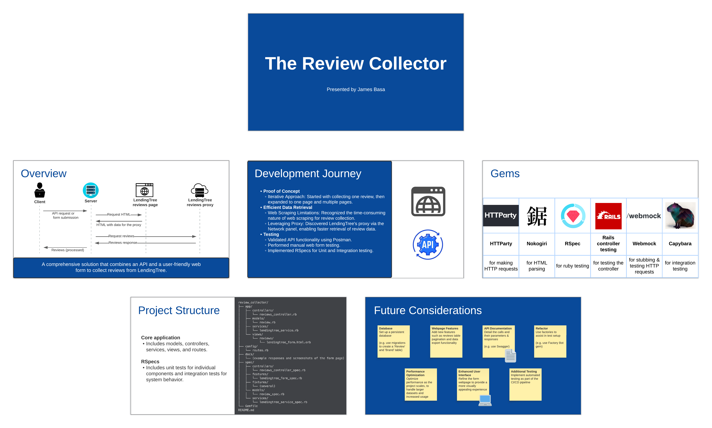
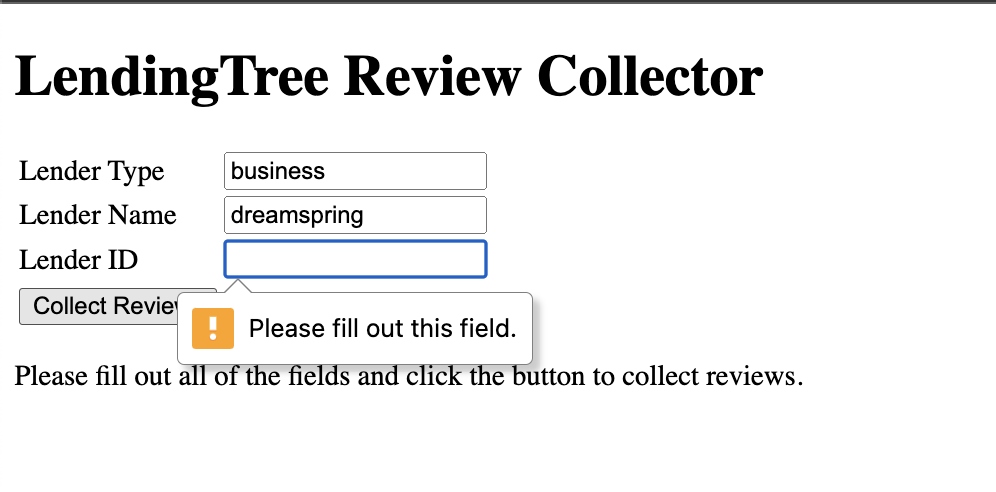
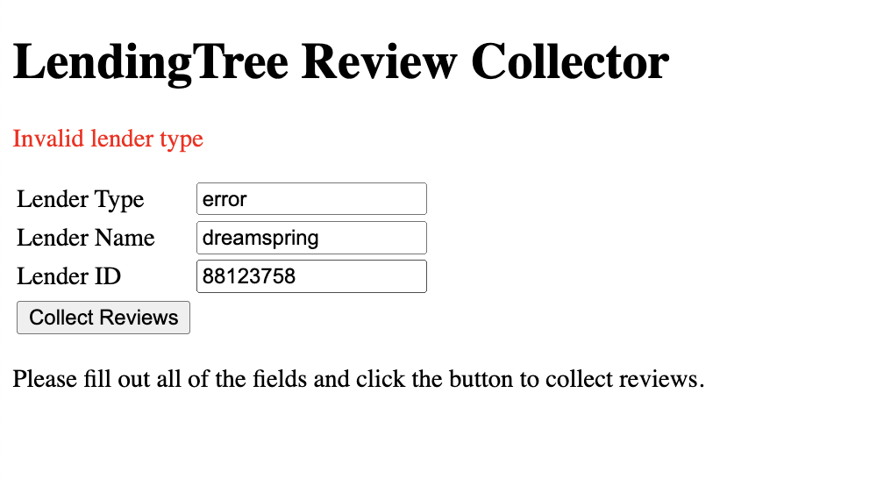
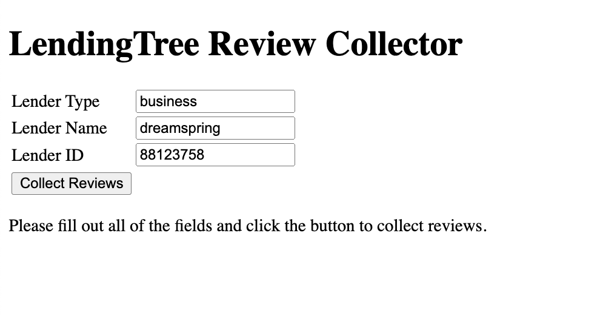
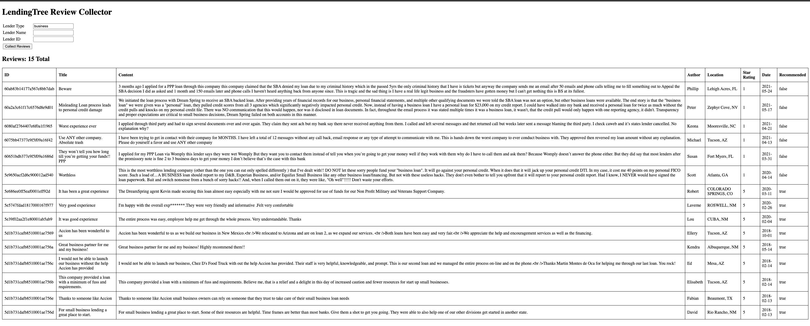

# Review-Collector

## Summary
An API and web form that collects reviews from [LendingTree](https://www.lendingtree.com/reviews).

## Presentation
[Lucidchart link](https://lucid.app/lucidspark/7f688284-6ec9-417c-a11a-e3b8a4b10c92/edit?invitationId=inv_57ac5e39-98fe-48c5-81e1-05d1cf5f7e58)
<br>

## Project Structure
```
review_collector/
├── app/
│   ├── controllers/
│   │   └── reviews_controller.rb
│   ├── models/
│   │   └── review.rb
│   ├── services/
│   │   └── lendingtree_service.rb
│   └── views/
│       └── reviews/
│           └── lendingtree_form.html.erb
├── config/
│   └── routes.rb
├── docs/
│   └── (example responses and screenshots of the form page)
├── spec/
│   ├── controllers/
│   │   └── reviews_controller_spec.rb
│   ├── features/
│   │   └── lendingtree_form_spec.rb
│   ├── fixtures/
│   │   └── (several)
│   └── models/
│   │   └── review_spec.rb
│   └── services/
│       └── lendingtree_service_spec.rb
└── Gemfile
README.md
```

## Usage Instructions
### How to run via frontend (web form)
1. Change into the rails directory using `cd review_collector`
2. Start the server using `rails s`
3. Visit http://127.0.0.1:3000/reviews/lendingtree
<br>
4. Fill out the `lender name` and `lender id`. The form requires you to.
<br>
5. Click the button to collect reviews
<br>
6. The reviews will be displayed in a table once they are collected
<br>

### How to run via API (Postman)
1. Access my Postman workspace here: https://www.postman.com/spacecraft-observer-56275265/workspace/review-collection
2. Start the server locally using `rails s`
3. Test GET requests using the configured Postman 'collections' in the workspace—each has several Postman tests setup.

### How to execute tests
1. Change into the rails directory using `cd review_collector`
2. Run all RSpecs using `rspec -fd spec`
